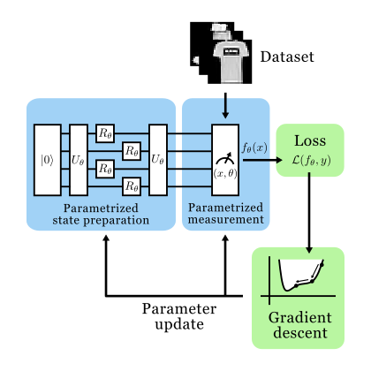

<h1 align="center">Hamiltonian classifier</h1>
<div align="center">

  <a href="">[](https://put-here-your-paper.com)</a>
  <a href="">[](https://opensource.org/licenses/Apache-2.0)</a>
  <a href="">[](https://www.python.org/)</a>

</div>

<p  align="center">
  
</p>

This repository implements the Hamiltonian classifier and its comparison with off-the-shelf methods as proposed in the paper [An Efficient Quantum Classifier Based on Hamiltonian Representations](https://www.youtube.com/watch?v=dQw4w9WgXcQ&pp=ygUXbmV2ZXIgZ29ubmEgZ2l2ZSB5b3UgdXA%3D). It contains the code to perform image and text classification on various datasets, a notebook to generate plots and tables, and the data needed to replicate them.

><details>
><summary> <b>Abstract</b> </summary>
>Quantum computing shows great potential for expanding the range of efficiently solvable problems. This promise arises from the advantageous resource and runtime scaling of certain quantum algorithms over classical ones. Quantum machine learning (QML) seeks to extend these advantages to data-driven methods. Initial evidence suggests quantum-based models can outperform classical ones in terms of scaling, runtime and generalization capabilities. However, critics have pointed out that many works rely on extensive feature reduction or use toy datasets to draw conclusions, raising concerns about their applicability to larger problems. Scaling up these results is challenging due to hardware limitations and the high costs generally associated with encoding dense vector representations on quantum devices. To address these challenges, we propose an efficient approach called <i>Hamiltonian classifier</i> inspired by ground-state energy optimization in quantum chemistry. This method circumvents the costs associated with data encoding by mapping inputs to a finite set of Pauli strings and computing predictions as their expectation values. In addition, we introduce two variants with different scaling in terms of parameters and sample complexity. We evaluate our approach on text and image classification tasks, comparing it to well-established classical and quantum models. Our results show the Hamiltonian classifier delivers performance comparable to or better than these methods. Notably, our method achieves logarithmic complexity in both qubits <i>and</i> quantum gates, making it well-suited for large-scale, real-world applications.
></details></p>

Contact person: [Federico Tiblias](mailto:federico.tiblias@tu-darmstadt.de) 

[UKP Lab](https://www.ukp.tu-darmstadt.de/) | [TU Darmstadt](https://www.tu-darmstadt.de/
)

Don't hesitate to send us an e-mail or report an issue, if something is broken or if you have further questions.


## Getting Started

Create a conda environment and install dependencies:

  ```bash
  conda env create -f requirements.yml
  conda activate hc
  ```
Then, download [GoogleNews-vectors-negative300.bin.gz](https://github.com/mmihaltz/word2vec-GoogleNews-vectors?tab=readme-ov-file) and place it in the `embeddings` folder.


The experiments log all data on [Weights & Biases](https://wandb.ai). If you're not interested, you can disable it with:
```bash
wandb disabled
```

## Usage

The Command Line Interface of this repository allows you to reproduce training runs, perform inference and carry out a hyperparameter random search. The basic syntax to start an experiment is  

```bash
python -m ham_classifier --mode <mode> --arch <arch> --dataset <dataset> 
```

- `--mode <mode>`: specifies what type of experiment will be run. `sweep` will perform a random search over predefined configurations. `run` will perform a single run. `infer` will run an existing model over a given dataset. All configurations can be found under `configs/`;
- `--arch <arch>`: specifies the model architecture. Supported choices are `ham`, `ham_peffbias`, `ham_dec`, `rnn`, `bow`, `mlp`, `lstm`, `cnn`, `circ`, `qlstm`, `qcnn`;
- `--dataset <dataset>`: specifies which dataset to train/evaluate on. Supported choices are `sst2`, `imdb`, `agnews`, `mnist2`, `fashion`, `cifar2`, `cifar10`.

Optionally, the CLI offers additional arguments to control the runs:
- `--sweep_seed`: repeats the given run over 10 randomized seeds. Only useful in `run` mode. If this argument is not provided, a single run with a default seed will take place;
- `--patience <n>`: enforces early stopping if the loss on the dev set does not decrease for `n` consecutive epochs;
- `--test`: if this argument is provided, the model will be trained on the full train (and dev set if present) and evaluated on the test set. If not, training will take place on the train set and evaluation on the dev set. If the dataset does not have a native train/dev split, an 80/20 one will be used instead;
- `--save_test_predictions`: if provided, saves the final test predictions under `data/<dataset>/`;
- `--emb_path <path>`: allows specifying an alternative embedding. Must be compatible with PyTorch's `nn.Embedding`;
- `--count <n>`: specifies how many randomized runs will take place in a `sweep`;

## Cite

Please use the following citation:

```
@InProceedings{TODO:EMNLP2024,
  author    = {Smith, John},
  title     = {My Paper Title},
  booktitle = {Proceedings of the 20XX Conference on XXXX},
  month     = mmm,
  year      = {20xx},
  address   = {Gotham City, USA},
  publisher = {Association for XXX},
  pages     = {XXXX--XXXX},
  url       = {http://xxxx.xxx}
}
```

## Disclaimer

> This repository contains experimental software and is published for the sole purpose of giving additional background details on the respective publication. 
