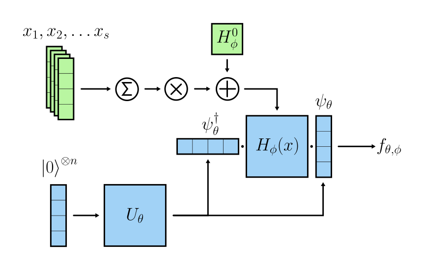

<h1 align="left">Hamiltonian classifier</h1>
<div align="left">

  <a href="">[](https://put-here-your-paper.com)</a>
  <a href="">[](https://opensource.org/licenses/Apache-2.0)</a>
  <a href="">[](https://www.python.org/)</a>

</div>

<p  align="left">
  
</p>

This repository implements the Hamiltonian classifier and its comparison with off-the-shelf methods as proposed in the paper [Quantum NLP in the LLM era - Common pitfalls, practical obstacles, and how to avoid them](https://www.youtube.com/watch?v=dQw4w9WgXcQ&pp=ygUXbmV2ZXIgZ29ubmEgZ2l2ZSB5b3UgdXA%3D). It contains the code of all experiments described in the paper, a notebook to generate plots and tables, and the data needed to replicate them.

><details>
><summary> <b>Abstract</b> </summary>
>Quantum computing is a discipline with a track record of exceptional theoretical understanding but few empirical demonstrations due to the engineering complexity of developing quantum devices. Unlike machine learning (ML) and natural language processing (NLP), which address noisy, unstructured, and intractable problems using data-intensive methods, the most promising quantum algorithms solve well-structured numerical problems with mathematically proven solutions, highlighting a fundamental difference in their conceptual approaches. In this paper, we provide a critical outlook on the field of quantum NLP (QNLP). We conclude that several differences exist that may prevent quantum-based architectures from ever being competitive with classical ones. To facilitate future research, we emphasize common pitfalls and suggest directions practitioners should explore to bridge the gap between quantum computing and NLP. Moreover, we introduce a new model inspired by variational quantum eigensolvers that circumvents some of the issues we raise in the paper and show its effectiveness on a simple but realistic text classification task.
></details></p>

Contact person: [Federico Tiblias](mailto:federico.tiblias@tu-darmstadt.de) 

[UKP Lab](https://www.ukp.tu-darmstadt.de/) | [TU Darmstadt](https://www.tu-darmstadt.de/
)

Don't hesitate to send us an e-mail or report an issue, if something is broken or if you have further questions.


## Getting Started

Create a conda environment and install dependencies:

  ```bash
  conda env create -f requirements.yml
  conda activate hc
  ```
Then, download [GoogleNews-vectors-negative300.bin.gz](https://github.com/mmihaltz/word2vec-GoogleNews-vectors?tab=readme-ov-file) and place it in the `embeddings` folder.


The experiments log all data on [Weights & Biases](https://wandb.ai). If you're not interested, you can disable it with:
```bash
wandb disabled
```

## Usage

### Hyperparameter search

This is how you can run a random search for a specific architecture: 

```bash
python -m ham_classifier --mode sweep --arch <arch_type> 
```
Supported choices for `arch_type` are `ham`, `circ`, `rnn`, `bow`, `mlp`. Optionally, you can include `--patience <n>` to enforce early stopping if loss on the dev set is not decreasing for `n` consecutive epochs.

### Training

This is how you can run several training runs for a specific architectures over multiple seeds:

```bash
python -m ham_classifier --mode run --sweep_seed --arch <arch_type>
```

### Inference

This is how you can evaluate a trained model on the SST dev and test sets:

```bash
python -m ham_classifier --mode inference --arch <arch_type> --model_name <model_name> --model_dir <model_dir>
```

Arguments:
- `--arch_type`: The architecture type. One of `ham`, `circ`, `rnn`, `bow`, `mlp`, `ablation_peffbias`, `ablation_nobias`, `ablation_sentin`, `ablation_circham`;
- `--model_dir`: Directory to which the models are saved. Model weights are saved by default with each training run in `models/`;
- `--model_name`: Model name of the run to evaluate as assigned by W&B;
- `--test`: Add this to evaluate on the test split of SST. 

### Inference with decomposed Hamiltonians

This is how you can replicate the Hamiltonian decomposition experiment in the appendix: 

```bash
python -m ham_classifier --arch ham --mode inference_simplified --model_name <model_name> --model_dir <model_dir>
```

## Cite

Please use the following citation:

```
@InProceedings{TODO:EMNLP2024,
  author    = {Smith, John},
  title     = {My Paper Title},
  booktitle = {Proceedings of the 20XX Conference on XXXX},
  month     = mmm,
  year      = {20xx},
  address   = {Gotham City, USA},
  publisher = {Association for XXX},
  pages     = {XXXX--XXXX},
  url       = {http://xxxx.xxx}
}
```

## Disclaimer

> This repository contains experimental software and is published for the sole purpose of giving additional background details on the respective publication. 
